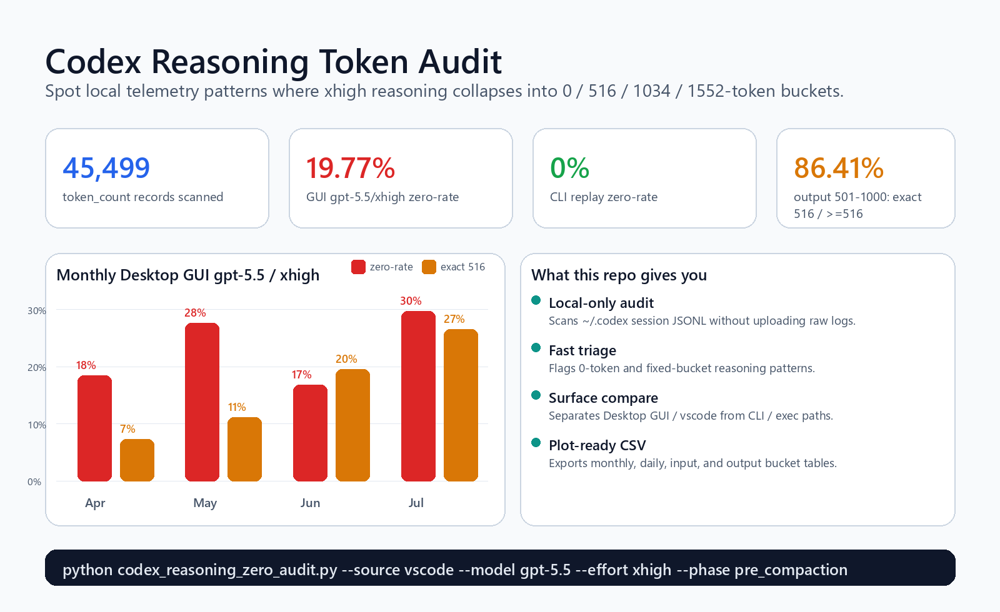

# Codex Reasoning Token Audit



Local-only audit tooling for Codex session telemetry. It helps spot `reasoning_output_tokens` collapse patterns such as `0`, `516`, `1034`, and `1552` without publishing raw conversations.

Use it when you want to answer:

- Are my Codex Desktop sessions showing high `reasoning_output_tokens=0` rates?
- Are `gpt-5.5 / xhigh` turns clustering around fixed reasoning-token buckets?
- Do Desktop GUI / `vscode` sessions behave differently from CLI / `exec` sessions?

## Quick Start

```bash
python codex_reasoning_zero_audit.py
```

Focused scan for the main reported surface:

```bash
python codex_reasoning_zero_audit.py --source vscode --model gpt-5.5 --effort xhigh --phase pre_compaction
```

Month-by-month view:

```bash
python codex_reasoning_zero_audit.py --source vscode --model gpt-5.5 --effort xhigh --phase pre_compaction --time-grain month
```

Output-size bucket view:

```bash
python codex_reasoning_zero_audit.py --source vscode --model gpt-5.5 --effort xhigh --phase pre_compaction --bucket-by output --min-records 100
```

CSV export for plots:

```bash
python codex_reasoning_zero_audit.py --source vscode --model gpt-5.5 --effort xhigh --phase pre_compaction --time-grain month --format csv > audit-month.csv
```

## What It Shows

From one sanitized local snapshot:

| Signal | Result |
| --- | ---: |
| Total `token_count` records scanned | 45,499 |
| Desktop GUI `gpt-5.5 / xhigh`, pre-compaction zero-rate | 19.77% |
| Desktop GUI `gpt-5.5 / xhigh`, post-compaction zero-rate | 21.29% |
| CLI `exec` `gpt-5.5 / xhigh`, pre-compaction zero-rate | 0.00% |
| Output 501-1000 bucket, exact `516 / >=516` | 86.41% |

Monthly Desktop GUI `gpt-5.5 / xhigh / pre_compaction`:

| Month | Records | Zero % | `<=516` % | Median | P90 | Exact 516 % | Exact 516 / `>=516` |
| --- | ---: | ---: | ---: | ---: | ---: | ---: | ---: |
| 2026-04 | 682 | 18.48 | 90.18 | 74.0 | 516.0 | 7.33 | 42.74 |
| 2026-05 | 1,195 | 27.62 | 90.96 | 54 | 516.0 | 11.13 | 55.19 |
| 2026-06 | 4,282 | 16.84 | 82.74 | 213.0 | 1034.0 | 19.57 | 53.14 |
| 2026-07 | 403 | 29.78 | 81.64 | 368 | 1279.2 | 26.55 | 59.12 |

The sharpest local bucket result was the `501-1000` output-token band: among turns that reached at least 516 reasoning tokens, `86.41%` landed exactly on `516`.

Full details:

- [`docs/local-findings.md`](docs/local-findings.md)
- [`docs/public-report.md`](docs/public-report.md)
- [`docs/sample-output.md`](docs/sample-output.md)

## Privacy Model

The audit runs locally and reports aggregates only.

By default, it does not print:

- prompts
- assistant messages
- session IDs
- local paths
- filenames

It also does not upload data.

Do not publish raw `.codex/sessions/*.jsonl` files. They can contain private conversation content, local paths, session IDs, and other user-specific data.

## More Commands

Scan a non-default Codex home directory:

```bash
python codex_reasoning_zero_audit.py --codex-home /path/to/.codex
```

Group by day and sort by zero-rate:

```bash
python codex_reasoning_zero_audit.py --source vscode --model gpt-5.5 --effort xhigh --phase pre_compaction --time-grain day --min-records 30 --sort-by zero-rate --top 10
```

Group by input-context size:

```bash
python codex_reasoning_zero_audit.py --source vscode --model gpt-5.5 --effort xhigh --phase pre_compaction --bucket-by input --min-records 100
```

Show scanned files while debugging:

```bash
python codex_reasoning_zero_audit.py --show-files
```

## Tests

```bash
python tests/test_fixture_output.py
python -m py_compile codex_reasoning_zero_audit.py tests/test_fixture_output.py
```

## Related Upstream Issue

This work was shared as a data point on [`openai/codex#30364`](https://github.com/openai/codex/issues/30364), which discusses `gpt-5.5` reasoning-token clustering around `516 / 1034 / 1552`.

This repo focuses on a related path-dependent observation: Desktop GUI / `vscode` telemetry showed a high zero-rate and fixed-bucket clustering in one local dataset, while comparable CLI / `exec` replays did not show the same zero-rate.

## Scope

This project treats `reasoning_output_tokens` as telemetry. It does not prove the model performed no internal reasoning. The useful claim is narrower:

> Local Codex telemetry can show a large path-dependent discrepancy in reported reasoning-token usage under the same displayed model and effort setting.

Potential investigation targets include:

- GUI-specific routing or fallback behavior
- reasoning-effort propagation differences
- response-stream or phase handling differences
- `token_count` telemetry under-reporting
- undocumented direct-final behavior under `xhigh`

## License

MIT
